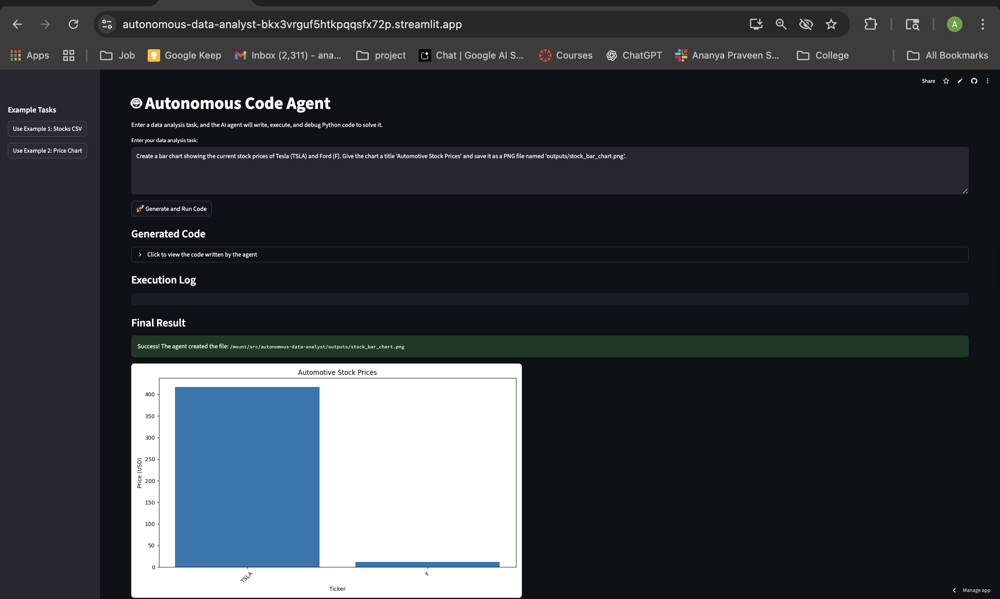
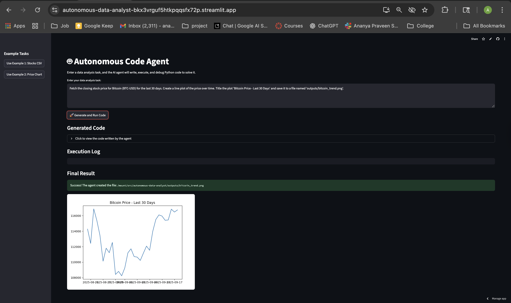

Of course. This is the final and most important step. A great README.md is your project's front door and your best chance to make a strong impression.

This README is written to be professional, comprehensive, and to tell a compelling story about the project. It highlights not just what you built, but the challenges you overcame, which is what truly impresses recruiters.

Action 1: Rename Your Screenshots

Before you do anything else, you must rename your screenshot files. Using filenames with spaces and special characters is unprofessional and can break links.

Go to your project folder: /Users/akshashe/Documents/sem3/langgraph-code-agent/

Find the file: Screenshot 2025-09-18 at 4.15.22 PM.png (this one looks like it shows the CSV result).

Rename it to: demo-csv.png

Find the file: Screenshot 2025-09-18 at 4.19.51 PM.png (this one probably shows the chart).

Rename it to: demo-chart.png

This is a critical step for a professional portfolio.

Action 2: Replace Your Entire README.md

Now, open your README.md file in your code editor. Select all the text and delete it. Then, copy and paste the entire block of text below into the empty file.

code
Markdown
download
content_copy
expand_less

# Autonomous AI Data Analyst Agent


---

## 🚀 Live Demo

**Try the live application here:** [**https://autonomous-data-analyst-bkx3vrguf5htkpqqsfx72p.streamlit.app/**](https://autonomous-data-analyst-bkx3vrguf5htkpqqsfx72p.streamlit.app/)

---

## Project Overview

This project is a powerful demonstration of an autonomous AI agent capable of solving data analysis tasks from natural language prompts. The agent plans a solution, writes Python code, and executes it to produce the desired output, such as CSV files or data visualizations.

The entire application is wrapped in an interactive web UI built with Streamlit, making it accessible to non-technical users.

### Generating a CSV File from a Prompt


### Generating a Visualization from a Prompt


## Key Features & Concepts Demonstrated

This project goes beyond a simple script and showcases a range of advanced AI engineering skills:

*   **Autonomous Code Generation:** The agent uses an LLM (Llama 3.1 8B via Groq) to dynamically write Python scripts tailored to the user's specific request.
*   **Sandboxed Code Execution:** For safe and reproducible execution, the generated code is run in an isolated environment. The original implementation used Docker for maximum security, while the deployed version uses a `subprocess` for compatibility with free hosting platforms.
*   **Advanced Prompt Engineering:** The agent's reliability is achieved through a highly-engineered system prompt that uses "Golden Path" examples and self-correction instructions to guide the LLM, minimizing errors and incomplete code.
*   **Full-Stack Application:** The project integrates a powerful AI backend with a clean, user-friendly frontend built with Streamlit, demonstrating the ability to build and deploy complete applications.

## Architecture and Workflow

The final architecture was simplified to a robust, single-shot model to maximize reliability with the chosen LLM. The workflow is as follows:

1.  The **Streamlit UI** captures the user's natural language task.
2.  The task is passed to the **Code Generation Agent**, which is guided by a highly-structured prompt.
3.  The LLM generates a complete Python script.
4.  The **Code Executor** runs this script in a sandboxed environment where necessary libraries are pre-installed.
5.  Any created files (CSVs, PNGs) or terminal output are captured and displayed back in the Streamlit UI.

```mermaid
graph TD
    A[User enters task in Streamlit UI] --> B{Code Generation Agent};
    B -- "Natural Language Task" --> C[LLM (Llama 3.1 8B)];
    C -- "Generated Python Script" --> D[Code Executor (Subprocess)];
    D -- "Creates File (e.g., CSV, PNG)" --> E[Display Result in Streamlit UI];
    D -- "Captures Terminal Output/Errors" --> E;
```
The Development Journey: A Lesson in Agent Reliability

A key part of this project was adapting the architecture to the capabilities of the LLM. The initial goal was a complex, multi-step, self-correcting agent using a LangGraph loop (Plan -> Code -> Execute -> Debug).

While testing, it became clear that the free-tier models (like Llama 3 8B) struggled with the long-term reasoning required for multi-step debugging, often getting stuck in infinite loops.

The final, more robust architecture pivoted to a single-shot generation model. This demonstrates a crucial AI engineering skill: designing the system and prompts around the strengths and weaknesses of the chosen LLM to achieve a reliable and performant result.

Tech Stack

Framework: LangChain, LangGraph (for initial architecture)

UI: Streamlit

LLM Provider: Groq

LLM: Llama 3.1 8B (llama-3.1-8b-instant)

Tools: yfinance, pandas, matplotlib

Deployment: Streamlit Community Cloud

Setup and Local Usage

Clone the repository:

code
Bash
download
content_copy
expand_less
IGNORE_WHEN_COPYING_START
IGNORE_WHEN_COPYING_END
git clone https://github.com/ananya101001/autonomous-data-analyst.git
cd autonomous-data-analyst

Create a virtual environment and install dependencies:

code
Bash
download
content_copy
expand_less
IGNORE_WHEN_COPYING_START
IGNORE_WHEN_COPYING_END
python -m venv venv
source venv/bin/activate  # On Windows: venv\Scripts\activate
pip install -r requirements.txt

Set up your API keys:

Create a file named .env in the root directory.

Add your API keys to it:

code
Code
download
content_copy
expand_less
IGNORE_WHEN_COPYING_START
IGNORE_WHEN_COPYING_END
GROQ_API_KEY="gsk_..."
TAVILY_API_KEY="tvly-..."

Run the application:

code
Bash
download
content_copy
expand_less
IGNORE_WHEN_COPYING_START
IGNORE_WHEN_COPYING_END
streamlit run app.py
code
Code
download
content_copy
expand_less
IGNORE_WHEN_COPYING_START
IGNORE_WHEN_COPYING_END
---

### **Action 3: Push Everything to GitHub**

Now that your `README.md` is perfect and your screenshots are renamed, you need to upload all of it to your GitHub repository.

1.  **In your terminal**, check the status to see your new files and changes:
    ```bash
    git status
    ```
2.  **Add all files** to be committed:
    ```bash
    git add .
    ```
3.  **Commit the changes** with a final, professional message:
    ```bash
    git commit -m "docs: Complete final README with live demo and screenshots"
    ```
4.  **Push to GitHub:**
    ```bash
    git push origin main
    ```

**You are now completely finished.** Your GitHub repository is a top-tier portfolio project with a live demo link, visual examples, a clear explanation of the architecture, and a compelling story of your development process. Congratulations
