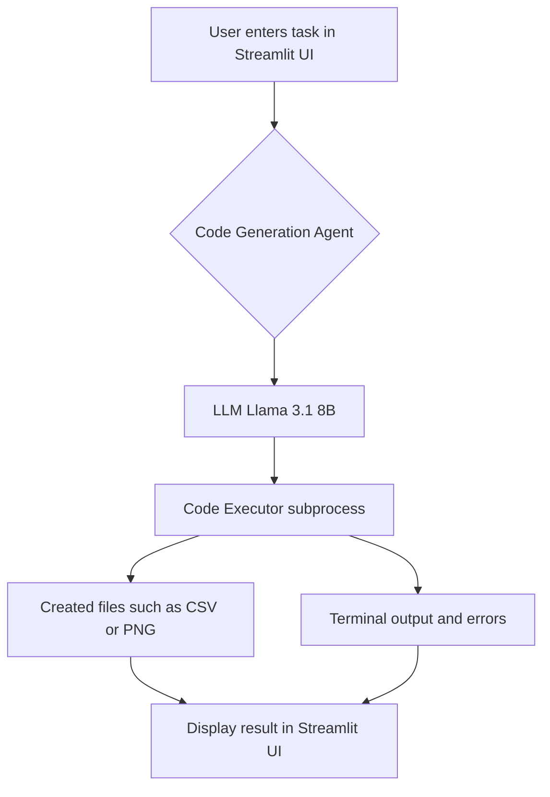

# Autonomous AI Data Analyst Agent


---

## 🚀 Live Demo

**Try the live application here:** [**https://autonomous-data-analyst-bkx3vrguf5htkpqqsfx72p.streamlit.app/**](https://autonomous-data-analyst-bkx3vrguf5htkpqqsfx72p.streamlit.app/)

---

## Project Overview

This project is a powerful demonstration of an autonomous AI agent capable of solving data analysis tasks from natural language prompts. The agent plans a solution, writes Python code, and executes it to produce the desired output, such as CSV files or data visualizations.

The entire application is wrapped in an interactive web UI built with Streamlit, making it accessible to non-technical users.

### Generating a CSV File from a Prompt


### Generating a Visualization from a Prompt


## Key Features & Concepts Demonstrated

This project goes beyond a simple script and showcases a range of advanced AI engineering skills:

*   **Autonomous Code Generation:** The agent uses an LLM (Llama 3.1 8B via Groq) to dynamically write Python scripts tailored to the user's specific request.
*   **Sandboxed Code Execution:** For safe and reproducible execution, the generated code is run in an isolated environment. The original implementation used Docker for maximum security, while the deployed version uses a `subprocess` for compatibility with free hosting platforms.
*   **Advanced Prompt Engineering:** The agent's reliability is achieved through a highly-engineered system prompt that uses "Golden Path" examples and self-correction instructions to guide the LLM, minimizing errors and incomplete code.
*   **Full-Stack Application:** The project integrates a powerful AI backend with a clean, user-friendly frontend built with Streamlit, demonstrating the ability to build and deploy complete applications.

## Architecture and Workflow

The final architecture was simplified to a robust, single-shot model to maximize reliability with the chosen LLM. The workflow is as follows:

1.  The **Streamlit UI** captures the user's natural language task.
2.  The task is passed to the **Code Generation Agent**, which is guided by a highly-structured prompt.
3.  The LLM generates a complete Python script.
4.  The **Code Executor** runs this script in a sandboxed environment where necessary libraries are pre-installed.
5.  Any created files (CSVs, PNGs) or terminal output are captured and displayed back in the Streamlit UI.


## The Development Journey: A Lesson in Agent Reliability

A key part of this project was adapting the architecture to the capabilities of the chosen LLM. The initial goal was a complex, multi-step, self-correcting agent using a LangGraph loop (`Plan -> Code -> Execute -> Debug`).

While testing, it became clear that the free-tier models (like Llama 3 8B) struggled with the long-term reasoning required for multi-step debugging, often getting stuck in infinite loops. They could not reliably diagnose environmental issues (like missing libraries) or maintain context between isolated code execution steps.

The final, more robust architecture pivoted to a **single-shot generation model**. This demonstrates a crucial AI engineering skill: **designing the system and prompts around the strengths and weaknesses of the chosen LLM to achieve a reliable and performant result.** The final system uses advanced prompt engineering with "Golden Path" examples to guide the LLM, dramatically increasing the success rate.

## Tech Stack
*   **Framework:** LangChain, LangGraph (for initial architecture)
*   **UI:** Streamlit
*   **LLM Provider:** Groq
*   **LLM:** Llama 3.1 8B (`llama-3.1-8b-instant`)
*   **Code Execution:** Python `subprocess` (deployed version), Docker (local development version)
*   **Data Libraries:** `yfinance`, `pandas`, `matplotlib`
*   **Deployment:** Streamlit Community Cloud

## Setup and Local Usage

1.  **Clone the repository:**
    ```bash
    git clone https://github.com/ananya101001/autonomous-data-analyst.git
    cd autonomous-data-analyst
    ```

2.  **Create a virtual environment and install dependencies:**
    ```bash
    python -m venv venv
    source venv/bin/activate  # On Windows: venv\Scripts\activate
    pip install -r requirements.txt
    ```

3.  **Set up your API keys:**
    *   Create a file named `.env` in the root directory. This file is ignored by Git and will not be uploaded.
    *   Add your API keys to it:
    ```
    GROQ_API_KEY="gsk_..."
    TAVILY_API_KEY="tvly-..."
    ```

4.  **Run the application:**
    ```bash
    streamlit run app.py
    ```
    Your browser will open to the chat interface automatically.
